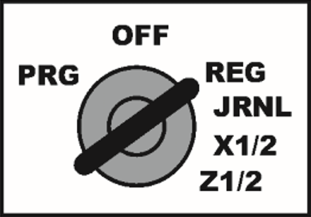
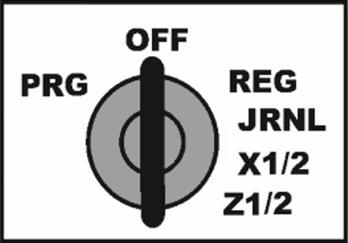
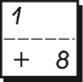
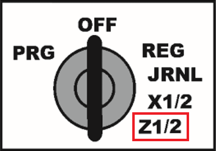

Morning
=======

1. Turn key to **REG**

    
 
Evening
=======

1. Open drawer

    

2. Remove money from drawer

3. Leave drawer open
 
4. Turn key to OFF

    
 
Receive payment
===============

1. Enter amount

    

    

2. Select product

    

3. Complete transaction

    

4. Close drawer

Report
======

1. Turn key to **Z1/Z2**

    

2. Print report

    

3. Keep report for accounting

_When report is printed totals sales and VAT are set to 0_
